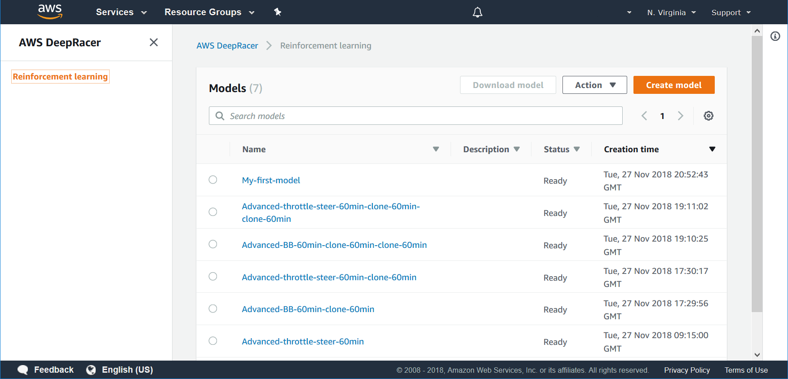
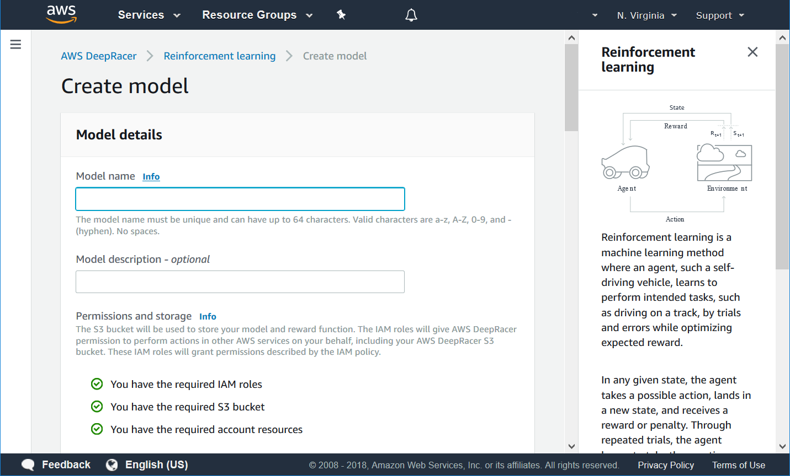
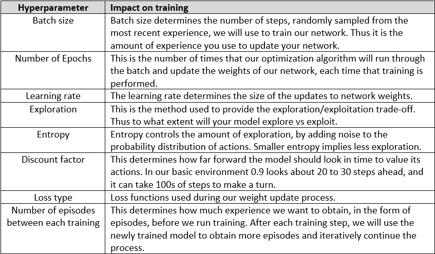
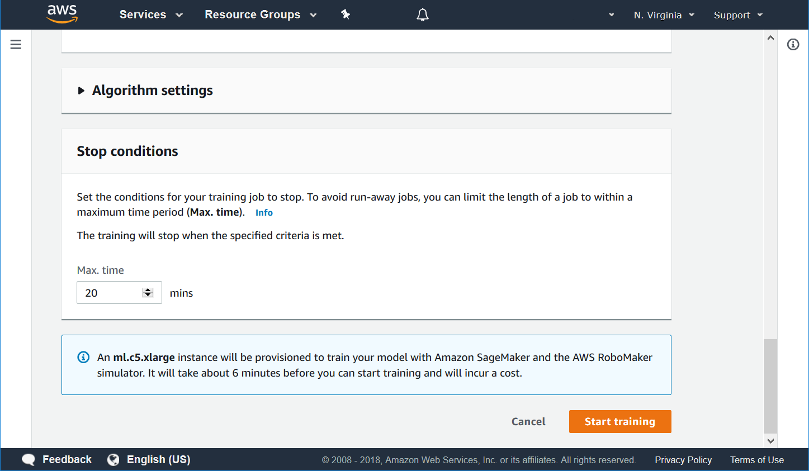

# Lab 1: Reward Function Constructors Championship!

## Overview
The goal of lab 1 is to get you familiar with the reward functions used to create RL models for AWS DeepRacer. To this end we have created an informal competition called the Reward Function Constructors Championship, where your team will compete to win bragging rights. The competition will also give you an overview of the AWS DeepRacer simulator found in the AWS Console.

#### Time breakdown

- Presenter explains competition:                     2 minutes
- Teams read lab content:                             8 minutes
- Teams discuss reward function:                     10 minutes
- Teams implement reward function and start training: 5 minutes
- Total:                                             25 minutes


## Reward Function Championship Instructions
Form a team with the other attendees at your table. Your team needs to create a reward function that will power you car, and the first team to reach the middle of the hairpin (the next turn on the track) with screenshot proof wins. The following image shows you where the finish line is. Note the finish line won't be on the track, so if you get halfway through the hairpin that is it, take a screenshot and shout out!  


Please read through the following sections and once done feel free to start discussing in your team which reward function you need to create to reach the objective. You will have 8 minutes to read the content, 10 minutes to debate the reward function and 5 minutes to implement it. Before you start training, nominate just one person to start training. Note we will continue with the workshop after the 25 minutes and this person will have to monitor the progress of training during the workshop. Everyone will get to implement their own reward function during lab 2.

Tip: As you read through the next sections carefully consider what behavior do you want to incentivize to ensure your car stays on track and makes the turn. You will have to write your reward function using Python, but we provide three good examples to look at.

Let's get going!

## Step 1: AWS Console
Logon to the AWS Console using the account details provided to you.
Navigate to AWS DeepRacer, https://aws.amazon.com/deepracer.
From the AWS DeepRacer landing page, expand the pane on the left and select **Reinforcement learning.**

## Step 2: Model List Page
This page gives a list of all the models you have created and each model's respective status.




If you don't have any models this list will be empty, and you can create a model by choosing **Create model**.
Once you have created models you can use this page to view the status of the model, for example is it training, or ready to download or evaluate. You can click on the model's name to proceed to the Model details page. Alternatively selecting the radio button next to a model name will allow you to delete the model, clone the model, or download the model, if training has completed.

Choose **Create model**


## Step 3: Create model
This page gives you the ability to create an RL model for AWS DeepRacer and start training. There are a few sections on the page, so let's look at each in detail.

#### Model details
Here you have the ability to name your model, provide a model description, and create the resources needed to start AWS DeepRacer training jobs. Note that the resources should be ready in the account given to you. If you do not see three green radio boxes beneath the Permission and storage section please let us know.


<font color=cyan>**Info**</font> **Buttons**
Throughout the console you will see <font color=cyan>**Info**</font> buttons. When selected they will slide out an information pane from the right of the window, without navigating away from the page.




Please enter a name for your model and scroll to the next section

#### Environment simulation
Here you will select the track on which your RL model will train. This track will be simulated by AWS RoboMaker throughout the training process, and you will be able to monitor training progress. We will cover that in a few steps.

At present we have only loaded one track into AWS DeepRacer. The track has the same shape that you will encounter at our AWS DeepRacer activities throughout re:Invent. We will have a detailed slide at the end of the workshop outlining the activities.

Choose the re:Invent 2018 track and scroll to the next section.

#### Reward function
In RL, the reward function plays a **critical** role in training an RL model. The reward function directly impacts the behaviors that your model will learn, by determining which actions (from each specific state) lead to good outcomes and which actions lead to outcomes that should best be avoided. The reward function contains the “logic” to determine if an action was good or bad, and quantify it. For example, if your goal is for the car to finish a lap around a racetrack, rewarding the car for staying on the track, as opposed to going off the track, is a good starting point. An example of the logic used in a basic reward function that incentivizes the car for staying closer to the middle of the track can be seen in the Basic Reward function section.

On the left-hand-side of the page, please expand the **Basic function** and choose **Insert code**. This action will copy the basic reward function code to the code editor on the right. **Note** that the code in the code editor on the right will be the reward function that is used to train your model.


The reward function in the code editor contains the following logic.
```
    marker_1 = 0.1 * track_width
    marker_2 = 0.25 * track_width
    marker_3 = 0.5 * track_width

    reward = 1e-3
    if distance_from_center >= 0.0 and distance_from_center <= marker_1:
        reward = 1
    elif distance_from_center <= marker_2:
        reward = 0.5
    elif distance_from_center <= marker_3:
        reward = 0.1
    else:
        reward = 1e-3  # likely crashed/ close to off track
        
```
Here we first create three bands around the track, using the three markers, and then proceed to reward the car more for driving in the narrow band as opposed to the medium or the wide band. Also note the differences in the size of the reward. We provide a reward of 1 for staying in the narrow band, 0.5 for staying in the medium band, and 0.1 for staying in the wide band. If we decrease the reward for the narrow band, or increase the reward for the medium band, we are essentially incentivizing the car to be use a larger portion of the track surface. This could come in handy, especially when there are sharp corners.

Here is a list of variables that you can use to build the logic for your reward function. Note that the reward function has to be written using Python syntax, and we've added a **Validate** button to help you check that your code is good before training begins. 


Please scroll to the next section, we will return to the reward function shortly.

#### Algorithm settings
This section controls the hyperparameters for your RL optimization algorithm. Please expand it. These hyperparameters have been optimized by our scientists, through lots of testing. That said you are more than welcome to change them. 

Training happens through an iterative process of simulation to gather experience, followed by training on the experience to update your model, followed by simulation using the new model to get new experience, followed by training on the new experience to update your model and so forth. Initially your model does not have any knowledge of which actions will lead to good outcomes. It will choose actions at random as it explores the environment. Over time it will learn which actions are better and start to exploit these. How quickly it exploits or how long it explores is a trade-off that you have to make.




Please scroll to the next section.
**Don't start training yet please**

#### Stop conditions
This is the last section before you start training. Here you can specify the maximum time your model will train for. Ideally you should put a number in this condition. You can always stop training early. Furthermore, if your mode stopped as a result of the condition, you can go to the model list screen, and clone your model to restart training using new parameters.

**Don't start training yet please**



## Step 5: Reward Function Constructors' Championship
Once you reach this section please discuss in your team the reward function you need to implement to reach the goal. You will have 10 minutes to create it and 5 minutes to implement and launch. 


